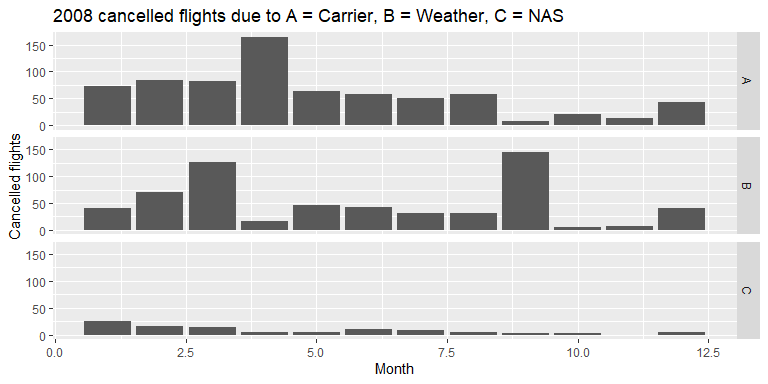
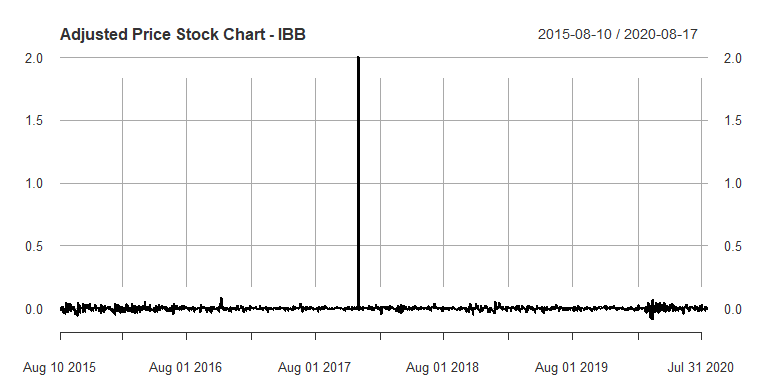

Exercise 1: Visual Story Telling Part 1 - Green Buildings
=========================================================

The Austin-based real estate developer is seeking to understand the
financial returns to green certification for her new building.
Construction of the building is priced at $100 million, with an expected
$5 million premium for green certification. An analyst on the
developer’s staff estimated that green certification for the building
will result in an additional $650,000 of yearly revenue and that it will
take 7.7 years to recuperate the premium, considering the building has
an occupancy rate of 100%. The analyst calculated his estimates by
looking at all buildings with leasing rates greater than 10%. The goal
of our analysis is to revisit the analyst’s estimates, using the same
data set containing statistics on 7,894 buildings, and determine if the
presented returns to green certification are accurate.

### Newer, Taller, Larger Buildings Have Higher Rental Rates

The developer’s building is 15 stories tall, 250,000 square feet, and
has an age of 0. To evaluate if the analyst should have accounted for
our building’s physical features, the below plots reveal the general
relationships between Rent and each of these features. The gray shading
around the line represents our margin of error for this estimate and the
vertical red line represents our building.


### Location, Location, and… Location

The building is located on East Cesar Chavez in Austin, Texas. Using
outside sources, we were able to identify the local employment growth
rate (2.5% as of March 31, 2020:
[source](https://www.austinchamber.com/blog/04-21-2020-job-growth-unemployment)),
average annual rainfall (34 inches:
[source](https://www.weather.gov/media/ewx/climate/ClimateSummary-ewx-Austin.pdf)),
and the number of degree days (2,248 heating days, 2,862 cooling days,
and 5,110 total degree days:
[source](https://www.eia.gov/energyexplained/units-and-calculators/degree-days.php)).
The data set measured the values for degree days in 2007 however, as the
2007 estimates were unavailable, we used the 2018 values as they are
likely a close estimate. We were unable to find information on the other
location-based variables present in the data set.

The below plots investigate whether these geographical characteristics
have any affect on a building’s rent. The red dashed line represents the
data set’s mean rent. While the direct relationship between the
following location-based features and rent may not be clear, they help
us understand where the rental market is inflated.

    ## Warning: Removed 73 rows containing non-finite values (stat_smooth).


The left plot indicates how rent is only stable for regions with
positive employment growth rates. Otherwise, rent greatly varies for
different levels of employment growth rates. The right plot reveals how
rent spikes for regions with greater precipitation. This graph may be
capturing the high rental rates for cities that receive high rainfall,
such as San Francisco and the Pacific Northwest region.


In the above plot, the big spike that occurs around 6,000 degree days is
likely capturing cities with more extreme temperatures; NYC, Chicago, or
Miami. The high left values with more moderate-climates may represent
the Pacific Northwest region. The dip in the lower right might capture
northern regions with very extreme weather and low property values.

The relationship between rent and regional variables is complicated.
Ultimately, it is best to account for as many physical and regional
features as possible when estimating returns to green certification.

### Taking A Relevant Subset

We obtained a subset of the buildings data set that contained buildings
within +/- 1 standard deviations of our building’s size, stories, age,
regional employment growth rate, regional annual rainfall, and regional
degree days. We dropped buildings that had less than 10% occupancy to
avoid outliers. This data set contained information on 314 buildings, 73
of which were green and 241 of which were non-green.

### What Can We Learn From Buildings With Similar Features?

Looking only at similar buildings, the median rent for a green building
is $22 while the median rent for a non-green building is $20.25.


Green buildings also have a higher median leasing rate of 91.43%
compared with the non-green leasing rate of 88.49%.


### Other Lurking Features Remain

The building’s quality is measured in the data set by standards of high
(class a), average (class b), or low (class c). The below plots reveal
how the quality of the building has a significant association with
higher rent per sq foot for buildings similar to ours. One would expect
green certified buildings to be of higher quality however, these
variables have a fairly low correlation of 0.248.


### Concluding Thoughts

The analyst’s conclusion that a green certification yields a greater
return was accurate however, his analysis was quite faulty. He greatly
overestimated the degree of the return in yearly rent per square foot as
he did not account for the building’s characteristics. The analyst
focused on the number of years it would take to recuperate the initial
premium. As it is almost impossible that every individual square foot of
a building could be rented out, these estimates are irrelevant.

Our analysis concluded that green certification is worth the extra
premium. Green buildings offer an additional $1.75 in yearly rent per
square foot, on average. Based upon higher average occupancy rates, it
is more likely that green buildings will have a higher total level of
income than non-green buildings. However, it is essential that the
developer ensure her building is of high quality as this variable leads
to a greater difference in rent for buildings similar to ours.

Exercise 2: Visual Story Telling Part 2 - Flights at ABIA
=========================================================

Our task is to create a figure, or set of related figures, that tell an
interesting story about flights into and out of Austin.

### Plots

March is the month with the most canceled flights.


Most canceled flights are due to carrier or weather. If we compare to
the previous plot, March cancellations are mostly because of weather.
However, the second month to have the most cancellations is April, which
cancellations are mostly due to carrier.


Considering all of the cancellations of the year. It seems that it’s not
good idea to take flights on the second quarter of the month.


However, if we look at the cancellations per month per day, September
and April are the months that are causing this spike.


Tuesday seems to be a bad choice to travel if we consider the total
cancellations of the year in that day.


Looking at the plot of canceled flights per month per day of the week.
We still see that Tuesday is the day with most canceled flights for
mostly of the months, being March and April the months with the higher
amount of cancellations on Tuesday.


Austin is the origin and destination with the most canceled flights. It
was taken out of the plot because the amount of canceled flights from
Austin is more than 4 times the amount of canceled flights of Dallas,
which made the other values seem irrelevant in magnitude.

DFW is the second origin and destination with the most canceled flights.


If we compare previous plots with the total amount of flights per
Origin, the reason why there more cancellations in Austin and Dallas may
be due to the amount of flights in those places rather than an external
value. For this plot, Austin was also taken out, because the magnitude
made the other values seem irrelevant.


Exercise 3: Portfolio Modeling
==============================

Clear global environment and load in necessary libraries. Setting seed
to keep numbers consistent.

### Portfolio 1

Load in stocks that will be included in the portfolio. Make sure that
they are gathering data for the past 5 years. Adjusted the stock prices
to account for splits, dividends, etc. – convert to Adjusted Closing
Prices.

These are the variations of returns and top few returns within each of
the stocks in the portfolio.


    ##               ClCl.QQQa    ClCl.SPYa     ClCl.VOOa     ClCl.GLDa
    ## 2015-08-07           NA           NA            NA            NA
    ## 2015-08-10  0.011422374  0.012599231  0.0126920754  1.022455e-02
    ## 2015-08-11 -0.012817074 -0.009023170 -0.0091666530  5.107841e-03
    ## 2015-08-12  0.003450136  0.001198064  0.0008885532  1.402219e-02
    ## 2015-08-13 -0.001628674 -0.001244467 -0.0010966943 -8.259852e-03
    ## 2015-08-14  0.001540747  0.003642260  0.0038687004 -9.360846e-05

Returns are calculated by (Price1 - Price0)/Price0. Due to there being
no previous data, the first entry has “NA” as the return. This code
block removes this from the data set so that results are more accurate.

This shows the pairwise plots (correlation matrix) between all the
stocks within the portfolio. Based on the plots, it is shown that QQQ,
SPY, and VOO all have a high positive correlation with one another. SPY
and VOO have a very high correlation, something that looks close to +1.
This is probably due to VOO and SPY both being ETFs drawn from the S&P
500 index.


Simulating through 5000 iterations of possible returns of the portfolio.

USD value of the possible returns through the 5000 iterations. Looking
at the histogram, this portfolio seems to be profitable as the average
return is greater than $100,000.

    ##               [,1]      [,2]      [,3]     [,4]      [,5]      [,6]      [,7]
    ## result.1  98842.44  98938.59  99269.39  98538.8  98227.16  98472.05  98550.36
    ## result.2 100416.91 100553.27 101197.95 101724.5 102375.30 102807.60 103561.33
    ## result.3  99266.65  99712.69 100709.42 101258.2 101557.77 101293.35 100884.05
    ## result.4 100122.02 100652.84 100493.65 100041.6 100766.47 101531.49 101564.98
    ## result.5 101335.87 101702.89 101574.07 100833.3 100810.91 100914.87 100890.10
    ## result.6 101201.50 101078.24 101417.01 100129.2  98510.79  96175.44  96204.12
    ##               [,8]      [,9]     [,10]     [,11]     [,12]     [,13]     [,14]
    ## result.1  99266.26  99513.63 100574.47 100738.20 101294.60 100887.40 100580.07
    ## result.2 103674.74 103758.47 103459.58 103340.02 103686.10 103823.32 103809.25
    ## result.3 101230.69  97583.53  97615.58  97877.53  97151.68  96886.37  97966.86
    ## result.4  99768.28 100458.97 101009.02 101225.43 101297.86 100691.33 100030.12
    ## result.5 100016.37 100397.42  98768.98  99432.84  99864.64  99569.26  99589.23
    ## result.6  96215.42 100590.52 100823.45 100445.71 100959.01 101542.27 101962.19
    ##              [,15]     [,16]     [,17]     [,18]     [,19]     [,20]
    ## result.1 100570.31 100029.23 100672.39  96325.77  96842.31  96272.68
    ## result.2 103749.53 104940.74 106268.83 107649.90 106874.43 105032.66
    ## result.3  98691.58  98718.72  98601.73  99086.22  99595.72 100695.70
    ## result.4 100654.02 100673.39  99796.66  99719.71  99991.39  99680.18
    ## result.5  98974.12  98131.41  98742.49  98452.18  98514.74  98259.17
    ## result.6 102088.81 102196.37 102243.94 102345.77 103182.64 104013.48


This outputs the average USD amount one can receive from this portfolio
as well as the average USD amount of the profit/loss yielded. The
histogram outputs the range of possible profits/losses. The mean yield
of this portfolio is $101,162.20 which returns a profit of $1,162.19
This is backed up by the histogram as the most likely scenarios shown is
above $0 which tells us that the portfolio yields a profitable return.

    ## [1] 101174.6

    ## [1] 1174.609


Outputs the 5% value at risk as well as the greatest and least possible
value at risks with this iteration.

    ##        5% 
    ## -6003.035

    ##     100% 
    ## 27820.59

    ## 0.000000000000001% 
    ##          -19904.86

### Analysis

We decided to pick QQQ, SPY, VOO, and GLD as they are all very popular
ETFs. If you buy/sell securities, then you most likely have one, if not
multiple, ETFs that we included. We decided to go with these 4 rather
than a safe ETF, an aggressive one, a diverse one, and some fourth one
as we wanted to mimic what one might really have in their personal
portfolio. Based on the 4 securities that are included and the results
from the code, it is seen that the average profit one will return with
an equally weighted portfolio will typically be positive. However, there
is possibility that this portfolio can return as much as $29,904.46 and
lose as most as $17,857.80 (both very unlikely). The VaR of this
portfolio is valued at $5,966.09 meaning that at the 5% confidence
level, the portfolio will lose $5,966.09. Each time the simulation runs,
these VaR levels change the amount one will return.

### Portfolio 2

Load in stocks that will be included in the portfolio. Make sure that
they are gathering data for the past 5 years. Adjusted the stock prices
to account for splits, dividends, etc. – convert to Adjusted Closing
Prices.

These are the variations of returns and top few returns within each of
the stocks in the portfolio.


    ##              ClCl.PDBCa    ClCl.DBCa     ClCl.GSGa    ClCl.DJPa    ClCl.USCIa
    ## 2015-08-07           NA           NA            NA           NA            NA
    ## 2015-08-10  0.005595859  0.021386909  0.0227921381  0.023715455  0.0156609864
    ## 2015-08-11  0.001669505 -0.013324873 -0.0150418376 -0.012741313 -0.0111110436
    ## 2015-08-12  0.006111167 -0.003215434 -0.0005656109 -0.005866250 -0.0130703964
    ## 2015-08-13  0.000000000 -0.004516129 -0.0084889643 -0.004720732  0.0051114543
    ## 2015-08-14 -0.016013307 -0.006480881 -0.0062785388 -0.003557312 -0.0002311142
    ##               ClCl.RJIa
    ## 2015-08-07           NA
    ## 2015-08-10  0.020484171
    ## 2015-08-11 -0.014598540
    ## 2015-08-12 -0.001851852
    ## 2015-08-13 -0.005565863
    ## 2015-08-14 -0.005597015

Returns are calculated by (Price1 - Price0)/Price0. Due to there being
no previous data, the first entry has “NA” as the return. This code
block removes this from the data set so that results are more accurate.

This shows the pairwise plots (correlation matrix) between all the
stocks within the portfolio. Based on the correlation plots, it is seen
that all stocks within portfolio 2 have a positive correlation with each
other. USCI does not have as high of correlation with any individual
stocks compared to the other 5 stocks. This can be seen as there is more
scatter in the plots that include USCI.


Simulating through 5000 iterations of possible returns of the portfolio.

USD value of the possible returns through the 5000 iterations. Looking
at the histogram, this portfolio can go back and forth between recording
a profit or loss. This is due to the histogram being centered around the
$100,000 mark.

    ##               [,1]      [,2]      [,3]     [,4]      [,5]      [,6]      [,7]
    ## result.1 100411.69 101609.56 101828.73 101086.9 100429.82 101403.16 101342.29
    ## result.2  99712.11 100128.58  99464.80  99857.5 101098.76 103107.69 102727.58
    ## result.3 101507.84 103289.17 104050.31 103031.5 102482.90 102728.33 103896.92
    ## result.4 100292.00 100850.57 100990.80 101028.5 100637.12 100646.44  99743.37
    ## result.5  99720.84 101527.93 101729.03 102240.3 101909.69 102070.07 101504.79
    ## result.6  99729.18  98935.58  98786.41 100201.4  98686.33  98236.67  99516.40
    ##               [,8]      [,9]     [,10]     [,11]     [,12]     [,13]    [,14]
    ## result.1 101939.88 101743.51 102225.93 101119.16 102374.72 104197.48 103859.7
    ## result.2 102405.25 102341.52 102099.32 101630.05 101647.34 101740.71 101993.6
    ## result.3 104384.06 104518.67 104149.18 104084.36 104134.47 104313.01 104976.1
    ## result.4  98886.82  98447.38  98112.95  98714.43  99677.88 101092.81 100448.5
    ## result.5 102656.26 102799.48 103008.06 103306.54 102865.39 101048.27 100697.7
    ## result.6  99027.87  97887.07  97269.16  97624.65  97498.16  99376.77  99779.4
    ##             [,15]     [,16]     [,17]     [,18]     [,19]     [,20]
    ## result.1 104204.7 103745.56 106231.71 106926.43 108244.36 107381.60
    ## result.2 101908.8 101511.28 101208.25 101804.53 104174.40 104320.28
    ## result.3 105359.9 104378.90 105951.81 106435.16 104495.11 103750.27
    ## result.4 100731.7 101021.90 101519.65 101968.38 101866.74 102330.75
    ## result.5 100758.0  99283.27  98544.73  99750.15  98501.79  98416.11
    ## result.6 100060.5 100348.35 101119.89 101276.65 100888.86 103894.73


This outputs the average USD amount one can receive from this portfolio
as well as the average USD amount of the profit/loss yielded. The
histogram outputs the range of possible profits/losses. On average, this
porfolio returns $99,778.61 which equates to an average loss of $221.37.

    ## [1] 99809.44

    ## [1] -190.5595


Outputs the 5% value at risk as well as the greatest and least possible
value at risks with this iteration.

    ##        5% 
    ## -7299.002

    ##     100% 
    ## 16311.71

    ## 0.000000000000001% 
    ##          -17545.96

### Analysis

We decided to pick 6 commodity ETFs as we had some interest in the
commodity market and as there has been a general decline recently. Based
on the 6 securities that are included, and the results from the code, it
is seen that the average profit one will return with this portfolio will
be -$221.37 in a 4 week period (20 trading days). However, there is
possibility that this portfolio can return as much as $15,028.38 and
lose as much as $18,442.35. The range of most likely yields, along with
the greatest loss and return amounts back up what we had previously
mentioned – commodities have generally been on the decline. Due to the
portfolio holder yielding a loss highlights the fact that commodities
are on the decline and are not as strong as they used to be. This is
also shown as the magnitude of the portfolio has the potential to lose a
far greater amount than what it can potentially gain. The VaR of this
portfolio is valued around $7,133.75 meaning that at the 5% confidence
level, the portfolio will lose $7,133.75. Each time the simulation runs,
these VaR levels change the amount one will return.

### Portfolio 3

Load in stocks that will be included in the portfolio. Make sure that
they are gathering data for the past 5 years. Adjusted the stock prices
to account for splits, dividends, etc. – convert to Adjusted Closing
Prices.

These are the variations of returns and top few returns within each of
the stocks in the portfolio.


    ##                ClCl.XLVa     ClCl.VHTa    ClCl.IBBa    ClCl.IHIa    ClCl.XBIa
    ## 2015-08-10            NA            NA           NA           NA           NA
    ## 2015-08-11 -0.0084288028 -0.0072478995 -0.011442559 -0.003100652 -0.021416930
    ## 2015-08-12  0.0006640324  0.0007796995  0.008143361 -0.001515288  0.007380563
    ## 2015-08-13 -0.0022564111 -0.0028331255 -0.010184796 -0.001437700 -0.016558620
    ## 2015-08-14  0.0027936545  0.0014206407 -0.006359322  0.004799280 -0.014813555
    ## 2015-08-17  0.0100822769  0.0122703450  0.020765841  0.007960516  0.041306083

Returns are calculated by (Price1 - Price0)/Price0. Due to there being
no previous data, the first entry has “NA” as the return. This code
block removes this from the data set so that results are more accurate.

This shows the pairwise plots (correlation matrix) between all the
stocks within the portfolio. By looking at the plots, XLV, VHT, and IHI
all have a general linear positive correlation with one another. IBB and
XBI both return very obscure correlation plots. We were unable to
determine why they output a peculiar plot or what these meant, however,
by looking at the stock return charts, both of these stocks have a
irregularity which is poteitally the reason for this.


Simulating through 5000 iterations of possible returns of the portfolio.

USD value of the possible returns through the 5000 iterations. The
histogram tells us that this portfolio will return, on average, a larger
profit compared to the previous two portfolios.

    ##              [,1]     [,2]     [,3]     [,4]     [,5]     [,6]     [,7]
    ## result.1 110424.0 111404.9 109831.5 109767.3 109884.4 110353.4 109611.7
    ## result.2 109392.8 108773.8 108367.3 108798.9 109942.1 110949.9 111471.0
    ## result.3 110289.3 111271.0 108677.7 108503.9 107845.7 105138.9 103282.4
    ## result.4 110295.4 109753.1 109876.6 108809.1 109887.3 108208.1 107013.5
    ## result.5 109608.4 107900.4 107946.9 108109.9 110489.0 111065.5 111305.6
    ## result.6 109082.2 110117.0 109785.0 109347.5 109637.2 109616.1 107573.7
    ##              [,8]     [,9]    [,10]    [,11]     [,12]    [,13]     [,14]
    ## result.1 110646.5 110924.5 113153.3 112322.7 112337.77 113563.4 114236.36
    ## result.2 111393.6 111918.9 112948.6 113215.1 118882.86 119694.3 120286.43
    ## result.3 102154.8 103207.5 102783.7 100366.6  99638.62 100462.1  99492.48
    ## result.4 107129.4 106740.0 108376.7 109408.7 109198.60 110765.1 110551.30
    ## result.5 111053.1 113203.6 113315.7 113509.0 113030.62 111260.8 109513.75
    ## result.6 108730.8 109069.1 110105.1 110716.9 111432.25 111597.5 111823.64
    ##              [,15]     [,16]     [,17]     [,18]     [,19]     [,20]
    ## result.1 115641.24 115232.31 113407.95 114444.81 114536.22 114140.95
    ## result.2 120264.26 119654.96 119720.82 121097.49 121714.95 121100.53
    ## result.3  96630.67  97471.79  87037.54  87917.39  87620.89  86709.29
    ## result.4 109274.17 108804.32 109491.89 110389.46 109208.26 108932.66
    ## result.5 110417.19 111221.70 110029.97 111462.65 112653.66 113933.82
    ## result.6 108991.70 110303.62 112073.06 112168.61 111069.65 108852.06


This outputs the average USD amount one can receive from this portfolio
as well as the average USD amount of the profit/loss yielded. The
histogram outputs the range of possible profits/losses. This portfolio
returns, on average, $112,755.70 with an average profit of $12,755.70.

    ## [1] 112791.6

    ## [1] 12791.57


Outputs the 5% value at risk as well as the greatest and least possible
value at risks with this iteration.

    ##       5% 
    ## -325.225

    ##   100% 
    ## 284404

    ## 0.000000000000001% 
    ##          -18048.25

### Analysis

Portfolio 3 consists of 5 funds in the Health & Biotech Equities ETFdb
Category with the largest value of total assets. We decided to go with
these securities as we are in the middle of an pandemic and thought it
would be interesting to observe the performance of funds in the
healthcare and biotechnology industries. This portfolio is a bit
different than the previous two as it is right skewed, meaning that
there are outliers for the portfolio holder to yield a large amount. The
Health & Biotech ETF portfolio shows that the expected return is
$274,932.50, meaning that one will typically make a profit investing of
$12,755.70 in these ETFs given their respective weights. There is
possibility that this portfolio can return as much as $274,932.50, and
lose as much as $16,711.00. The 5% VaR of this portfolio is valued
$175.20 meaning that at the 5% confidence level, the portfolio will lose
$175.20. Each time the simulation runs, these VaR levels change the
amount one will return.

Exercise 4: Market Segmentation
===============================

Our task to is analyze this data as you see fit, and to prepare a
concise report for NutrientH20 that identifies any interesting market
segments that appear to stand out in their social-media audience.

We performed a PCA analysis to get the components that represents the
variance of the data set better. This PCA wasn’t scaled because the
units are the same (\# of tweets for that category) and we want to give
more importance to the biggest magnitude.

### Variance

The first component explains 17.51%. This is not bad if we take into
account that we have 7882 observations. When we add the second
component, the cumulative variance increases to 30.195%.

    ## Importance of components:
    ##                           PC1     PC2     PC3     PC4     PC5     PC6     PC7
    ## Standard deviation     0.1080 0.09189 0.07701 0.07316 0.06771 0.05371 0.05198
    ## Proportion of Variance 0.1751 0.12685 0.08909 0.08040 0.06887 0.04334 0.04059
    ## Cumulative Proportion  0.1751 0.30195 0.39104 0.47144 0.54032 0.58365 0.62425
    ##                            PC8     PC9    PC10    PC11    PC12    PC13    PC14
    ## Standard deviation     0.04840 0.04437 0.04358 0.03924 0.03790 0.03572 0.03541
    ## Proportion of Variance 0.03518 0.02957 0.02853 0.02314 0.02157 0.01916 0.01884
    ## Cumulative Proportion  0.65943 0.68900 0.71754 0.74068 0.76225 0.78141 0.80025
    ##                           PC15    PC16    PC17    PC18    PC19    PC20    PC21
    ## Standard deviation     0.03379 0.03247 0.03075 0.03043 0.02940 0.02796 0.02714
    ## Proportion of Variance 0.01715 0.01584 0.01420 0.01391 0.01299 0.01174 0.01106
    ## Cumulative Proportion  0.81740 0.83324 0.84744 0.86136 0.87434 0.88609 0.89715
    ##                           PC22    PC23    PC24    PC25    PC26    PC27    PC28
    ## Standard deviation     0.02652 0.02590 0.02515 0.02416 0.02399 0.02374 0.02320
    ## Proportion of Variance 0.01056 0.01008 0.00951 0.00877 0.00865 0.00846 0.00808
    ## Cumulative Proportion  0.90771 0.91779 0.92729 0.93606 0.94471 0.95317 0.96126
    ##                           PC29    PC30    PC31    PC32    PC33    PC34     PC35
    ## Standard deviation     0.02266 0.02239 0.02125 0.02060 0.01959 0.01732 0.002179
    ## Proportion of Variance 0.00771 0.00753 0.00678 0.00638 0.00577 0.00450 0.000070
    ## Cumulative Proportion  0.96897 0.97650 0.98328 0.98966 0.99542 0.99993 1.000000
    ##                            PC36
    ## Standard deviation     2.54e-16
    ## Proportion of Variance 0.00e+00
    ## Cumulative Proportion  1.00e+00

We use scree plots to make a better decision. The elbow in the plot
seems to be on PC6 with a cumulative variance explains 58.36%


### Analyzing components

The first PC seems to be Appearance v. Fitness.

While chatter might not have been categorized, it could also mean that
these tweets were just the users talking with other users. Based on
this, maybe they like to go out to shop, look good to share photos, and
going for a coffee to talk about non-categorized data.

On the other side, outdoors activities, cooking, personal fitness, and
health nutrition seems to describe people that like to take care of
themselves. Maybe they go to the gym and run outside in the mornings. To
maintain their shape they have to take care of what they eat.

For this PC, it seems to be University communities v. (Appearance &
Fitness)

Positive values seems to be related to university people aware of news
and politics, but also into travel, sports, online gaming, and a pinch
of religion. Negative values have characteristics from the previous PC.

    ##      Classification           PC1
    ## 1           chatter  0.6596440606
    ## 2     photo_sharing  0.2681445658
    ## 3          shopping  0.1673343866
    ## 4    current_events  0.0825880243
    ## 5            travel  0.0239457739
    ## 6        automotive  0.0212294923
    ## 7     uncategorized  0.0194620233
    ## 8          business  0.0152219910
    ## 9           tv_film  0.0145415891
    ## 10            music  0.0119720173
    ## 11         politics  0.0118906806
    ## 12   small_business  0.0105427560
    ## 13           family  0.0101348191
    ## 14  home_and_garden  0.0096244387
    ## 15        computers  0.0057011619
    ## 16      college_uni  0.0056167264
    ## 17           school  0.0049647760
    ## 18           dating  0.0038527233
    ## 19           crafts  0.0034691539
    ## 20   sports_playing  0.0028709930
    ## 21              eco  0.0007003594
    ## 22             spam -0.0000549105
    ## 23            adult -0.0060129151
    ## 24    sports_fandom -0.0116854527
    ## 25           beauty -0.0142591736
    ## 26    online_gaming -0.0143838182
    ## 27              art -0.0151602920
    ## 28          fashion -0.0176389617
    ## 29        parenting -0.0196244242
    ## 30             news -0.0283224167
    ## 31         religion -0.0343854537
    ## 32             food -0.0748285739
    ## 33         outdoors -0.1044506640
    ## 34          cooking -0.1666358825
    ## 35 personal_fitness -0.2649720827
    ## 36 health_nutrition -0.5810374909

Based on the scree plot, we thought that 6 PC would be a good number to
describe the variance of the data. However, going through the data, we
find that the characteristics are repeated, just with some extra
appearances in the last PCs like dating, cooking, and family. All of
these could be related to previous characteristics. Cooking to health
nutrition, dating to chatters, and photo sharing, family with college,
or sports. Therefore, we just consider the first two PCs.

    ##      Classification           PC2
    ## 1          politics  0.2724073759
    ## 2       college_uni  0.2109431067
    ## 3              news  0.1797056340
    ## 4     sports_fandom  0.1663172704
    ## 5            travel  0.1614495732
    ## 6     online_gaming  0.1579512235
    ## 7          religion  0.1185106395
    ## 8           tv_film  0.0896285774
    ## 9         parenting  0.0792078823
    ## 10       automotive  0.0713088951
    ## 11             food  0.0614435158
    ## 12              art  0.0580712661
    ## 13        computers  0.0527604958
    ## 14           family  0.0472901488
    ## 15           school  0.0398772053
    ## 16   sports_playing  0.0340613853
    ## 17            adult  0.0317452184
    ## 18           beauty  0.0126053431
    ## 19   small_business  0.0118197809
    ## 20            music  0.0116889576
    ## 21           crafts  0.0097173009
    ## 22  home_and_garden  0.0037498476
    ## 23         business  0.0013112982
    ## 24             spam  0.0005520415
    ## 25          fashion -0.0019064753
    ## 26    uncategorized -0.0024801044
    ## 27   current_events -0.0069077261
    ## 28           dating -0.0073419061
    ## 29              eco -0.0209565859
    ## 30         outdoors -0.0633870461
    ## 31          cooking -0.0989177476
    ## 32         shopping -0.1374028330
    ## 33    photo_sharing -0.2135846544
    ## 34 personal_fitness -0.2631357014
    ## 35          chatter -0.5031893680
    ## 36 health_nutrition -0.5649138351

### Plotting first two PCs

The plots seem to have all three groups that we previously mentioned in
a well defined manner. On the left, the fitness people. On the right,
the appearance people. On the top, university people.


### K-means

To see if the clusters actually exists, we do k-means with the PCA
scores. We use k = 3, since 3 is the numbers of groups we found in PCA.

As said before, the three groups are very well defined. On the left
(green), the fitness people. On the right (red), the appearance people.
On the top (blue), university people.


What would happen with k = 4?

Fitness people cluster seems to be unchanged. A new group appeared
between university people and appearance people. This may be the cluster
that started to appear after PC5 with the food, dating, art, automotive,
characteristics. However, it seems that the first 3 clusters are good
enough to describe the data.


To conclude, we found 3 main groups of people with very defined
characteristics. Spam and adult columns weren’t thrown away. However,
they seem not to be important in any PC from 0 to 6. If they had
appeared to be an important characteristic and if the company is not
related to adult products the columns may have been removed.

Exercise 5: Author Attribution
==============================

NOTE: All of our group members’ computers froze and could not complete
the knitting process for this exercise. Due to that, all of the code
blocks for Exercise 5 are not being evaluated (eval=FALSE) as PCA takes
too much time to process/knit. We would like to run the last code block
to show the accuracy, however, it does not work without running the
previous blocks of code. Due to this abnormality, we are not running
anything and instead outputting the hard code behind this exercise and
all our descriptions for each hard code block. If you would like to run
this code on your own, we recommend you copy and paste this exercise’s
code into a separate file. When this exercise is in its own, individual
file, this does run.

The goal of this exercise is to predict the author of an article on the
basis of that article’s textual content. We began by installing the
necessary libraries.

### Reading in the data

The data is stored in 50 articles within a folder for 50 individual
authors. There are two directories, a training directory and a test.
Each contains the 50 articles for the same 50 authors. Altogether, here
are 2,500 articles in the training directory and 2,500 in the test
directory. The following code explains how the data was read in.

``` r
#reading in the training data
dir_train = 'C:/Users/india/Documents/GitHub/STA380/data/ReutersC50/C50train/'
files_train = list.files(dir_train, recursive=T) #vector containing all data in C50 Train folder

#initializing variables to grab train data 
train_i = 1 #index to grab all files for each author
file_train = NULL #empty vector to hold all text 
vector_train = NULL #empty vector to hold all authors names

#getting author and file vectors for the training data
for(x in 1:length(files_train)){ #loop through each entry in files_train vector
  #author_train grabs the author of each file
  author_train = substr(files_train[train_i], start=1, stop=str_locate(files_train[train_i], "/")-1) 
  
  #file_t grabs and combines all text from folder in C50Train directory with author's name
  file_t = read_file(paste0(dir_train, files_train[train_i]))
  
  file_train = c(file_train,file_t) #vector containing all text from each author
  vector_train = c(vector_train,author_train) #vector containing names of all authors
  train_i = train_i + 1 #inc. index to grab next file 
}
#vector_train contains 50 entries of each author's name 
#file_train contains 50 text files for each of the 50 authors

#reading in the test data
dir_test = 'C:/Users/india/Documents/GitHub/STA380/data/ReutersC50/C50test/'
files_test = list.files(dir_test, recursive=T) #vector containing all data in C50Test folder

#initializing same variables to grab test data
test_i = 1 #index to grab all files for each author
file_test = NULL #empty vector to hold all text 
vector_test = NULL #empty vector to hold all authors names

#getting author and file vectors for the test data
for(x in 1:length(files_test)){ #loop through each entry in files_test vector
  #author_test grabs the author of each file
  author_test = substr(files_test[test_i], start=1, stop=str_locate(files_test[test_i], "/")-1) 
  
  #file_test grabs and combines all text from folder in directory w authors name
  f_test = read_file(paste0(dir_test, files_test[test_i]))
  
  file_test = c(file_test,f_test) #vector containing all text from each author
  vector_test = c(vector_test,author_test) #vector containing names of all authors
  test_i = test_i + 1 #inc. index to grab next file 
}

#Checking to make sure we have 50 text files for 50 authors. There should be 50*50=2500 authors and text files for both train and test data
if(length(file_train) == 2500 & length(vector_train) == 2500){print("Train Data Read Successfully")}
if(length(file_test) == 2500 & length(vector_test) == 2500){print("Test Data Read Successfully")}
```

### Preprocessing the data

We pre-processed the data by creating a document term matrix for the
train and test data sets. This matrix has column names that are the
tokens in each file. Each row corresponds to an individual document. The
values in the matrix are the number of times each token appeared in each
document.

The tokens were created by first created a corpus, a giant body of all
of the documents. Each of the words in the documents were transformed to
lower case and numbers, punctuation, and excess white-space were
removed. Additionally, all stop-words from the basic English dictionary
were removed, removing all generic words so that we can focus on the
unique diction of each quote.

The document term matrix for the training set contained 31,752 terms. We
then removed all terms that do not appear in 99% of the documents. This
may decrease the accuracy of our model however, it makes our process
computationally feasible. As the words removed were very rare (only
occurring in 1% of all quotes), it is likely that the cost in accuracy
is minimal. Ultimately, the training DTM contained 3,325 words. We
pre-processed the test set in exactly the same manner. The resulting
test DTM contained also 3,325 words.

``` r
### PRE-PROCESSING: CREATING A DOC-TERM-MATRIX ###

#creating a text mining corpus for all the quotes
train_raw = Corpus(VectorSource(file_train))
#vector source reads in documents one by one
#corpus constructs a corpus consisted of all documents by one author

train_doc = train_raw %>%
  tm_map(content_transformer(tolower))  %>%             # make everything lowercase
  tm_map(content_transformer(removeNumbers)) %>%        # remove numbers
  tm_map(content_transformer(removePunctuation)) %>%    # remove punctuation
  tm_map(content_transformer(stripWhitespace))          # remove excess white-space

#using "basic English" stop words 
train_doc = tm_map(train_doc, content_transformer(removeWords), stopwords("en"))
#produces warning.. no documents are actually dropped

## create a doc-term-matrix from the corpus
DTM_train = DocumentTermMatrix(train_doc)
DTM_train # some basic summary statistics
#contains 2500 documents with 31,752 terms
#sparsity = 99% indicates we removed terms that only appear in at most 1% of the data
#maximal term length of 36 indicates that the largest number of characters within 1 term is 36


#dropping terms that only occur in one or two documents as there is nothing to learn if a term occurred once.
## Below removes those terms that have count 0 in >99% of docs.  
DTM_train = removeSparseTerms(DTM_train, 0.99)
DTM_train # now ~ 3,325 #Can adjust this percentage if you want to run this code to your own specifications? 
DTM_train1 <- as.matrix(DTM_train)

### PRE-PROCESSING TEST SET

#creating a text mining corpus for all the quotes
test_raw = Corpus(VectorSource(file_test))
#vector source reads in documents one by one
#corpus constructs a corpus consisted of all documents by one author

test_doc = test_raw %>%
  tm_map(content_transformer(tolower))  %>%             # make everything lowercase
  tm_map(content_transformer(removeNumbers)) %>%        # remove numbers
  tm_map(content_transformer(removePunctuation)) %>%    # remove punctuation
  tm_map(content_transformer(stripWhitespace))          # remove excess white-space

#using "basic English" stop words (maybe try again with SMART?)
test_doc = tm_map(test_doc, content_transformer(removeWords), stopwords("en"))
#produces warning.. no documents are actually dropped

## create a doc-term-matrix from the corpus
DTM_test = DocumentTermMatrix(test_doc)
DTM_test # some basic summary statistics
#contains 2500 documents with 31,752 terms
#sparsity = 99% indicates we removed terms that only appear in at most 1% of the data
#maximal term length of 36 indicates that the largest number of characters within 1 term is 36


#dropping terms that only occur in one or two documents as there is nothing to learn if a term occurred once.
## Below removes those terms that have count 0 in >99% of docs.  
DTM_test = removeSparseTerms(DTM_test, 0.99)
DTM_test # now ~ 3,325 #MAYBE ADJUST THIS LATER 
DTM_test1 <- as.matrix(DTM_test)
```

As we want to fit our model on the documents in the training files, the
processing procedure becomes a bit complicated as the test files may
contain words that our model has not seen before. The test set contained
398 new words.

To help our model process these new words, we added a pseudo-word to the
train DTM, labeled “filler\_vector” and added a pseudo-count to it. We
accomplished this by creating a vector containing all the new words in
the test set. Then from the test DTM, we summed up the values in the new
word’s columns to create a vector that contained the number of new words
in each document. We then randomly sampled this vector with replacement
to create the “filler\_vector”. This filler vector will serve as a
pseudo-word for all new words in the test set. Our model will be trained
using it. As it is filled with a randomly generated sample of the actual
counts of new words in the test set, it offers a degree of randomization
to our training model so that our test DTM is still unfamiliar and is
useful for predictions.

``` r
## ADD a filler word to DTM_train to fill with new words in test set 

#words in train DTM:
train_words <- colnames(DTM_train1)
test_words <- colnames(DTM_test1)

#finding words that are in test but not train
new_words = setdiff(test_words,train_words) 
length(new_words)#398 new words
length(test_words) #3370 total words 

filler <- c(new_words) #this currently has all new words in test 

new_wordsDF = DTM_test1[,filler]
totalnew <- rowSums(new_wordsDF) #vector for the test set with  how many words are 'new' for each test document.

# sampling with replacement to get the train 'filler' vector - provides degree of randomization in our filler_vector
filler_vector <- sample(totalnew, 2500, replace = TRUE)

#create a dataframe just new "filler" words
test_words <- data.frame(filler_vector)  

#combined DTM matrix 
test_trainDTM <- cbind(DTM_train1, test_words)
```

However, we still needed to pre-process the test set. The test DTM
contains words that are in the test set but not the training set. We
needed to remove those words and their associated rows out of the test
set as they are unfamiliar to the model. We replaced those words with a
filler vector, a vector that actually contains the count of new words in
each document. We used a randomly sampled version of this vector in our
training set to build the model.

``` r
## continuing to pre-process the test set 

#filler is a vector of the words in test but not in train 
`%ni%` <- Negate(`%in%`) #setting this tool to find elements that are not elemnts in another list 
DTM_test1 <- as.data.frame(DTM_test1) #turning test DTM matrix into a dataframe 
DTM_test2 <- DTM_test1[,which(names(DTM_test1) %ni% filler)] #creating a dataframe with words that are in train 

#sanity check: there were 3370 total words in test DTM. We found 398 new words. This data frame should have 
#2972 columns (new words)
if(length(names(DTM_test2))==2972){print("yay success!")}

# "totalnew" contained the count of new words for each test document. 
#create a dataframe with just the count of "new" words in each document 
test_not_new_words <- data.frame(totalnew)  

#combined test DTM matrix 
test_DTM <- cbind(DTM_test2, test_not_new_words)
```

### TFIDF Calculation

Next, we calculated the TF-IDF weights of each word in both the train
and test DTMs.

``` r
#TFIDF FOR TRAIN DTM 

N = nrow(test_trainDTM) #number of rows in train DTM with psuedo filler_vector
D = ncol(test_trainDTM) #number of columns 
# TF weights
TF_mat = test_trainDTM /rowSums(test_trainDTM)

# IDF weights
IDF_vec = log(1 + N/colSums(test_trainDTM  > 0))

# TF-IDF weights:
# use sweep to multiply the columns (margin = 2) by the IDF weights
TFIDF_mat = sweep(TF_mat, MARGIN=2, STATS=IDF_vec, FUN="*")  

# spot check an entry
TF_mat[5, 224]
IDF_vec[224]
TFIDF_mat[5,224] == TF_mat[5, 224] * IDF_vec[224]

y <- factor(vector_train) #response vector creates factors of the names of 50 authors

#TFIDF FOR TEST DTM 

y_test <- factor(vector_test) #response vector as name of author

Ntest = nrow(test_DTM)
Dtest = ncol(test_DTM)
# TF weights
TF_mattest = test_DTM /rowSums(test_DTM)

# IDF weights
IDF_vectest = log(1 + N/colSums(test_DTM  > 0))

# TF-IDF weights:
# use sweep to multiply the columns (margin = 2) by the IDF weights
TFIDF_mattest = sweep(TF_mattest, MARGIN=2, STATS=IDF_vectest, FUN="*")  

# spot check an entry
TF_mattest[5, 224]
IDF_vectest[224]
TFIDF_mattest[5,224] == TF_mattest[5, 224] * IDF_vectest[224]
```

### Principal Component Analysis

We then applied principal component analysis to our training data set to
reduce the dimensions of our data. This creates linear combinations of
original predictor variables to allow us to capture the variance in the
data set. We applied PCA to our train data with 10 components, 25
components, and then 40 components. The greater the number of
components, the greater the processing power required, and the greater
amount of variation captured. PCA with 10 components accounts for 5.48%
of the variation in our data, 25 accounts for 9.89%, and 40 accounts for
13.263%.

The first component captures the maximum variance in the data set and
the second captures the second highest variability. By looking at the
loadings of the first component, we find that it is contrasting words
that are political in nature and relate to the US vs China political
discourse with more business and market oriented words. The second
component contrasts words related to factories, specifically factories
in the MidWestern US, with words also related to business and the
markets.

``` r
### PCA on the TF-IDF weights with 10 PCS
pc_train10 = prcomp(TFIDF_mat, rank=10, scale=TRUE)
loadings = pc_train10$rotation
dim(loadings) #3326 rows with 10 PCs.. expected
scores = pc_train10$x #location
summary(pc_train10) #accounts for 5.48 percent of variation 
```

``` r
comp1 = order(loadings[,1], decreasing=TRUE)
colnames(TFIDF_mat)[head(comp1,25)] 
colnames(TFIDF_mat)[tail(comp1,25)] 
#first component contrasts political words (china/democracy/communism)
#with business words (stock/market/analyst/sales)

comp2 = order(loadings[,2], decreasing=TRUE)
colnames(TFIDF_mat)[head(comp2,25)] 
colnames(TFIDF_mat)[tail(comp2,25)] 
#2nd component contrasts factory (detroit/automaker/strike) 
#with business words (markets/growth/billion)

#merging author name with first 10 PCs
training10 = merge(y, pc_train10$x[,1:10], by="row.names")


### PCA on the TF-IDF weights with 25 PCS (takes longer)
pc_train25 = prcomp(TFIDF_mat, rank=25, scale=TRUE)
loadings2 = pc_train25$rotation
dim(loadings2) #3326 rows with 25 PCs... expected
scores2 = pc_train25$x #location
summary(pc_train25) #25 PC account for 9.89% variation 

### look into what first 2 components indicate 
comp1_25 = order(loadings2[,1], decreasing=TRUE)
colnames(TFIDF_mat)[head(comp1_25,25)] 
colnames(TFIDF_mat)[tail(comp1_25,25)] 
#first component contrasts same as above

comp2_25 = order(loadings2[,2], decreasing=TRUE)
colnames(TFIDF_mat)[head(comp2_25,25)] 
colnames(TFIDF_mat)[tail(comp2_25,25)] 
#2nd component contrasts same as above

#merging author name with first 25 PCs
training25 = merge(y, pc_train25$x[,1:25], by="row.names")

### Looking at 40 components! 
### PCA on the TF-IDF weights with 40 PCS (takes a lot longer)
pc_train40 = prcomp(TFIDF_mat, rank=40, scale=TRUE)
loadings40 = pc_train40$rotation
dim(loadings40) #3326 rows with 40 PCs... expected
scores40 = pc_train40$x #location
summary(pc_train40) #40 PC account for 13.263% variation 

### look into what first 2 components indicate 
comp1_40 = order(loadings40[,1], decreasing=TRUE)
colnames(TFIDF_mat)[head(comp1_40,25)] 
colnames(TFIDF_mat)[tail(comp1_40,25)] 
#first component contrasts same as above

comp2_40 = order(loadings40[,2], decreasing=TRUE)
colnames(TFIDF_mat)[head(comp2_40,25)] 
colnames(TFIDF_mat)[tail(comp2_40,25)] 
#2nd component contrasts same as above

#merging author name with first 25 PCs
training40 = merge(y, pc_train40$x[,1:40], by="row.names")
```

### Applying unsupervised learning to supervised learning

We proceeded by running 3 types of multinomial regressions. The first
used the first 10 PCs to predict authorship, the second the first 25
pcs, and the third the first 40 PCs. By looking at the misclassification
rate on the training data, we found the model using 10 PCs attained
52.32% accuracy, the model with 25 PCs attained 77.6% accuracy, and the
model with 40 PCs attained 91.24% accuracy. Obviously, the model with 40
PC outperformed the other models on the training set.

``` r
#applying first 10 PC in multinomial regression
train_lm10 <- multinom(x ~ PC1+PC2+PC3+PC4+PC5+PC6+PC7+PC8+PC9+PC10, data = training10)
summary(train_lm10) #residual deviance: 7330.694

## interpreting train_lm10
#getting yhat predictions for train data
pred10 <- predict(train_lm10, newdata = training10, "class")

# Building classification table
ctable10 <- table(training10$x, pred10)

# Calculating accuracy - sum of diagonal elements divided by total obs.. only about 52.32% accurate on train data
round((sum(diag(ctable10))/sum(ctable10))*100,2)

# predicted probabilities for authors
head(pp10 <- fitted(train_lm10))


#applying first 25 PC in multinomial regression
train_lm25 <- multinom(x ~ PC1+PC2+PC3+PC4+PC5+PC6+PC7+PC8+PC9+PC10+PC11+PC12+PC13+PC14
                       +PC15+PC16+PC17+PC18+PC19+PC20+PC21+PC22+PC23+PC24+PC25, 
                       data = training25, MaxNWts=1500)
summary(train_lm25) 

## interpreting train_lm25
#getting yhat predictions for train data
pred25 <- predict(train_lm25, newdata = training25, "class")

# Building classification table
ctable25 <- table(training25$x, pred25)

# Calculating accuracy - sum of diagonal elements divided by total obs.. about 77.6% accurate.. a lot better on train
round((sum(diag(ctable25))/sum(ctable25))*100,2) #inc number of PC's does help! 

# predicted probabilities for authors
head(pp25 <- fitted(train_lm25))


#applying first 40 PC in multinomial regression
train_lm40 <- multinom(x ~ PC1+PC2+PC3+PC4+PC5+PC6+PC7+PC8+PC9+PC10+PC11+PC12+PC13+PC14
                       +PC15+PC16+PC17+PC18+PC19+PC20+PC21+PC22+PC23+PC24+PC25+PC26+PC27+PC28+PC29+PC30+PC31+PC32+PC33+PC34
                       +PC35+PC36+PC37+PC38+PC39+PC40,
                       data = training40, MaxNWts=2200)
summary(train_lm40) 

## interpreting train_lm25
#getting yhat predictions for train data
pred40 <- predict(train_lm40, newdata = training40, "class")

# Building classification table
ctable40 <- table(training40$x, pred40)

# Calculating accuracy - sum of diagonal elements divided by total obs.. about 91.24% accurate.. a lot better on train
#but at a cost to computation speed
round((sum(diag(ctable40))/sum(ctable40))*100,2) #inc number of PC's does help! 

# predicted probabilities for authors
head(pp40 <- fitted(train_lm40))
```

### Making predictions with test data

Before proceeding, we realized that the TFIDF matrix for training data
has 3326 words while the test TFIDF has 2973. This is because we removed
all 398 new words from the test data set. In order to apply the
principal components from our train set on the test set, the columns
(the words) of the TFIDF test and train matrices need to be exactly the
same. We need to add in all the words that are in the training set and
not in test to the test set and give them a TFIDF count of 0, as they do
not appear at all.

``` r
#we need to set the last column containing count of new words in test data set to be of the same name as train.. filler_vector
names(TFIDF_mattest)[length(names(TFIDF_mattest))]<-"filler_vector" 

tfidf_train <- colnames(TFIDF_mat)
tfidf_test <- colnames(TFIDF_mattest)
words2add = c(setdiff(tfidf_train,tfidf_test)) #creating a vector of the words that are different between 2 sets

#creating a matrix of 0 with 2500 rows and number of columns equal to number of new words 2 add 
words2add_matrix <- matrix(0, 2500, length(words2add)) 
#create this into a dataframe
words2addDF <- data.frame(words2add_matrix) 
#specifying the col names as words in train that will be added to test 
colnames(words2addDF) <- words2add

#combined test TFIDF dataframe
TFIDF_test <- cbind(TFIDF_mattest, words2addDF)
```

Now, we’re ready to predict authorship of the files in the test
directory. We began by applying the PCA from the training set onto the
test data. We then made multinomial predictions by applying each of our
multinomial models onto test data sets containing 10 train PCs, 25 train
PCs, and 40 train PCs.

``` r
###transform test TFIDF into training PCA

#for 10 PC
test.data10 <- predict(pc_train10, newdata = TFIDF_test)
test.data10 <- as.data.frame(test.data10)
test10 = merge(y_test, test.data10, by="row.names") #merging PC with actual authors

#make multinomial prediction on test data
pred10 <- predict(train_lm10, test10[,3:12], "class") #grabbing class predictions (author predictions)

# Building classification table
ctable_test10 <- table(test10$x, pred10)
# Calculating accuracy - sum of diagonal elements divided by total obs.. 37.88% accurate
round((sum(diag(ctable_test10))/sum(ctable_test10))*100,2)


#for 25 PC
test.data25 <- predict(pc_train25, newdata = TFIDF_test)
test.data25 <- as.data.frame(test.data25)
test25 = merge(y_test, test.data25, by="row.names") #merging PC with actual authors

#make multinomial prediction on test data
pred25 <- predict(train_lm25, test25[,3:27], "class") #grabbing class predictions (author predictions)

# Building classification table
ctable_test25 <- table(test25$x, pred25)
# Calculating accuracy - sum of diagonal elements divided by total obs.. 49.4% accurate
round((sum(diag(ctable_test25))/sum(ctable_test25))*100,2)


#for 10 PC
test.data40 <- predict(pc_train40, newdata = TFIDF_test)
test.data40 <- as.data.frame(test.data40)
test40 = merge(y_test, test.data40, by="row.names") #merging PC with actual authors

#make multinomial prediction on test data
pred40 <- predict(train_lm40, test40[,3:42], "class") #grabbing class predictions (author predictions)

# Building classification table
ctable_test40 <- table(test40$x, pred40)
# Calculating accuracy - sum of diagonal elements divided by total obs.. 50.28 accurate
round((sum(diag(ctable_test40))/sum(ctable_test40))*100,2)
```

### Our results

On the test data, the model with 10 PCs achieved 37.88% accuracy, with
25 PCs achieved 49.4% accuracy, and with 40 PCs achieved 50.28%
accuracy. It is rather interesting that though the model with 40 PCs had
a training classification rate that was significantly higher than the
other models, it barely outperformed the model with 25 PCs on the test
data set. In conclusion, the model with 25 PCs is the optimal model. It
performs well enough on the test data set while being computationally
affordable.

Exercise 6: Association Rule Mining
===================================

This reads in the groceries.txt file as a transaction data set and
inspects the first 6 baskets.

``` r
groceries = read.transactions(file = "https://raw.githubusercontent.com/jgscott/STA380/master/data/groceries.txt",
                          format = c("basket"), sep = ",")

arules::inspect(head(groceries))
```

    ##     items                     
    ## [1] {citrus fruit,            
    ##      margarine,               
    ##      ready soups,             
    ##      semi-finished bread}     
    ## [2] {coffee,                  
    ##      tropical fruit,          
    ##      yogurt}                  
    ## [3] {whole milk}              
    ## [4] {cream cheese,            
    ##      meat spreads,            
    ##      pip fruit,               
    ##      yogurt}                  
    ## [5] {condensed milk,          
    ##      long life bakery product,
    ##      other vegetables,        
    ##      whole milk}              
    ## [6] {abrasive cleaner,        
    ##      butter,                  
    ##      rice,                    
    ##      whole milk,              
    ##      yogurt}

With a threshold of support=0.05, the most frequent items in the data
set are selected and the top 15 are shown. They are sorted by decreasing
support.

``` r
FrequentItems = eclat(groceries, parameter = list(support = 0.05))
```

    ## Eclat
    ## 
    ## parameter specification:
    ##  tidLists support minlen maxlen            target  ext
    ##     FALSE    0.05      1     10 frequent itemsets TRUE
    ## 
    ## algorithmic control:
    ##  sparse sort verbose
    ##       7   -2    TRUE
    ## 
    ## Absolute minimum support count: 491 
    ## 
    ## create itemset ... 
    ## set transactions ...[169 item(s), 9835 transaction(s)] done [0.00s].
    ## sorting and recoding items ... [28 item(s)] done [0.00s].
    ## creating sparse bit matrix ... [28 row(s), 9835 column(s)] done [0.00s].
    ## writing  ... [31 set(s)] done [0.00s].
    ## Creating S4 object  ... done [0.00s].

``` r
FrequentItems <- sort(FrequentItems, by = "support", decreasing = TRUE)
arules::inspect(head(FrequentItems, 15))
```

    ##      items              support    transIdenticalToItemsets count
    ## [1]  {whole milk}       0.25551601 2513                     2513 
    ## [2]  {other vegetables} 0.19349263 1903                     1903 
    ## [3]  {rolls/buns}       0.18393493 1809                     1809 
    ## [4]  {soda}             0.17437722 1715                     1715 
    ## [5]  {yogurt}           0.13950178 1372                     1372 
    ## [6]  {bottled water}    0.11052364 1087                     1087 
    ## [7]  {root vegetables}  0.10899847 1072                     1072 
    ## [8]  {tropical fruit}   0.10493137 1032                     1032 
    ## [9]  {shopping bags}    0.09852567  969                      969 
    ## [10] {sausage}          0.09395018  924                      924 
    ## [11] {pastry}           0.08896797  875                      875 
    ## [12] {citrus fruit}     0.08276563  814                      814 
    ## [13] {bottled beer}     0.08052872  792                      792 
    ## [14] {newspapers}       0.07981698  785                      785 
    ## [15] {canned beer}      0.07768175  764                      764

This plot shows the absolute frequency of the top 15 groceries in the
data set (outputted above).


This plot shows the relative frequency of the top 15 groceries in the
data set (outputted above).


A total of 32791 rules are created when using support=0.001 and
confidence=0.1. Below only show the top 6 association rules.

``` r
groceryRules <- apriori(groceries, parameter = list(support = 0.001, confidence = 0.1))
```

    ## Apriori
    ## 
    ## Parameter specification:
    ##  confidence minval smax arem  aval originalSupport maxtime support minlen
    ##         0.1    0.1    1 none FALSE            TRUE       5   0.001      1
    ##  maxlen target  ext
    ##      10  rules TRUE
    ## 
    ## Algorithmic control:
    ##  filter tree heap memopt load sort verbose
    ##     0.1 TRUE TRUE  FALSE TRUE    2    TRUE
    ## 
    ## Absolute minimum support count: 9 
    ## 
    ## set item appearances ...[0 item(s)] done [0.00s].
    ## set transactions ...[169 item(s), 9835 transaction(s)] done [0.01s].
    ## sorting and recoding items ... [157 item(s)] done [0.00s].
    ## creating transaction tree ... done [0.00s].
    ## checking subsets of size 1 2 3 4 5 6 done [0.03s].
    ## writing ... [32791 rule(s)] done [0.01s].
    ## creating S4 object  ... done [0.01s].

``` r
arules::inspect(head(groceryRules))
```

    ##     lhs    rhs               support   confidence coverage lift count
    ## [1] {}  => {bottled water}   0.1105236 0.1105236  1        1    1087 
    ## [2] {}  => {tropical fruit}  0.1049314 0.1049314  1        1    1032 
    ## [3] {}  => {root vegetables} 0.1089985 0.1089985  1        1    1072 
    ## [4] {}  => {soda}            0.1743772 0.1743772  1        1    1715 
    ## [5] {}  => {yogurt}          0.1395018 0.1395018  1        1    1372 
    ## [6] {}  => {rolls/buns}      0.1839349 0.1839349  1        1    1809

This creates a new rules matrix that sorts grocery rules by decreasing
support. Again, the first 15 association rules of this new rules matrix
are shown.

``` r
rulesSupport <- sort(groceryRules, by = "support", decreasing = TRUE)
arules::inspect(head(rulesSupport, 15))
```

    ##      lhs                   rhs                support    confidence coverage 
    ## [1]  {}                 => {whole milk}       0.25551601 0.2555160  1.0000000
    ## [2]  {}                 => {other vegetables} 0.19349263 0.1934926  1.0000000
    ## [3]  {}                 => {rolls/buns}       0.18393493 0.1839349  1.0000000
    ## [4]  {}                 => {soda}             0.17437722 0.1743772  1.0000000
    ## [5]  {}                 => {yogurt}           0.13950178 0.1395018  1.0000000
    ## [6]  {}                 => {bottled water}    0.11052364 0.1105236  1.0000000
    ## [7]  {}                 => {root vegetables}  0.10899847 0.1089985  1.0000000
    ## [8]  {}                 => {tropical fruit}   0.10493137 0.1049314  1.0000000
    ## [9]  {other vegetables} => {whole milk}       0.07483477 0.3867578  0.1934926
    ## [10] {whole milk}       => {other vegetables} 0.07483477 0.2928770  0.2555160
    ## [11] {rolls/buns}       => {whole milk}       0.05663447 0.3079049  0.1839349
    ## [12] {whole milk}       => {rolls/buns}       0.05663447 0.2216474  0.2555160
    ## [13] {yogurt}           => {whole milk}       0.05602440 0.4016035  0.1395018
    ## [14] {whole milk}       => {yogurt}           0.05602440 0.2192598  0.2555160
    ## [15] {root vegetables}  => {whole milk}       0.04890696 0.4486940  0.1089985
    ##      lift     count
    ## [1]  1.000000 2513 
    ## [2]  1.000000 1903 
    ## [3]  1.000000 1809 
    ## [4]  1.000000 1715 
    ## [5]  1.000000 1372 
    ## [6]  1.000000 1087 
    ## [7]  1.000000 1072 
    ## [8]  1.000000 1032 
    ## [9]  1.513634  736 
    ## [10] 1.513634  736 
    ## [11] 1.205032  557 
    ## [12] 1.205032  557 
    ## [13] 1.571735  551 
    ## [14] 1.571735  551 
    ## [15] 1.756031  481

This creates a new rules matrix that sorts grocery rules by decreasing
confidence Again, the first 15 association rules of this new rules
matrix are shown.

``` r
rulesConfidence <- sort(groceryRules, by = "confidence", decreasing = TRUE)
arules::inspect(head(rulesConfidence, 15))
```

    ##      lhs                     rhs                    support confidence    coverage     lift count
    ## [1]  {rice,                                                                                      
    ##       sugar}              => {whole milk}       0.001220132          1 0.001220132 3.913649    12
    ## [2]  {canned fish,                                                                               
    ##       hygiene articles}   => {whole milk}       0.001118454          1 0.001118454 3.913649    11
    ## [3]  {butter,                                                                                    
    ##       rice,                                                                                      
    ##       root vegetables}    => {whole milk}       0.001016777          1 0.001016777 3.913649    10
    ## [4]  {flour,                                                                                     
    ##       root vegetables,                                                                           
    ##       whipped/sour cream} => {whole milk}       0.001728521          1 0.001728521 3.913649    17
    ## [5]  {butter,                                                                                    
    ##       domestic eggs,                                                                             
    ##       soft cheese}        => {whole milk}       0.001016777          1 0.001016777 3.913649    10
    ## [6]  {citrus fruit,                                                                              
    ##       root vegetables,                                                                           
    ##       soft cheese}        => {other vegetables} 0.001016777          1 0.001016777 5.168156    10
    ## [7]  {butter,                                                                                    
    ##       hygiene articles,                                                                          
    ##       pip fruit}          => {whole milk}       0.001016777          1 0.001016777 3.913649    10
    ## [8]  {hygiene articles,                                                                          
    ##       root vegetables,                                                                           
    ##       whipped/sour cream} => {whole milk}       0.001016777          1 0.001016777 3.913649    10
    ## [9]  {hygiene articles,                                                                          
    ##       pip fruit,                                                                                 
    ##       root vegetables}    => {whole milk}       0.001016777          1 0.001016777 3.913649    10
    ## [10] {cream cheese,                                                                              
    ##       domestic eggs,                                                                             
    ##       sugar}              => {whole milk}       0.001118454          1 0.001118454 3.913649    11
    ## [11] {curd,                                                                                      
    ##       domestic eggs,                                                                             
    ##       sugar}              => {whole milk}       0.001016777          1 0.001016777 3.913649    10
    ## [12] {cream cheese,                                                                              
    ##       domestic eggs,                                                                             
    ##       napkins}            => {whole milk}       0.001118454          1 0.001118454 3.913649    11
    ## [13] {brown bread,                                                                               
    ##       pip fruit,                                                                                 
    ##       whipped/sour cream} => {other vegetables} 0.001118454          1 0.001118454 5.168156    11
    ## [14] {grapes,                                                                                    
    ##       tropical fruit,                                                                            
    ##       whole milk,                                                                                
    ##       yogurt}             => {other vegetables} 0.001016777          1 0.001016777 5.168156    10
    ## [15] {ham,                                                                                       
    ##       pip fruit,                                                                                 
    ##       tropical fruit,                                                                            
    ##       yogurt}             => {other vegetables} 0.001016777          1 0.001016777 5.168156    10

This creates a new rules matrix that sorts grocery rules by decreasing
lift Again, the first 15 association rules of this new rules matrix are
shown.

``` r
rulesLift <- sort(groceryRules, by = "lift", decreasing = TRUE)
arules::inspect(head(rulesLift, 15))
```

    ##      lhs                        rhs                         support confidence    coverage     lift count
    ## [1]  {bottled beer,                                                                                      
    ##       red/blush wine}        => {liquor}                0.001931876  0.3958333 0.004880529 35.71579    19
    ## [2]  {hamburger meat,                                                                                    
    ##       soda}                  => {Instant food products} 0.001220132  0.2105263 0.005795628 26.20919    12
    ## [3]  {ham,                                                                                               
    ##       white bread}           => {processed cheese}      0.001931876  0.3800000 0.005083884 22.92822    19
    ## [4]  {other vegetables,                                                                                  
    ##       root vegetables,                                                                                   
    ##       whole milk,                                                                                        
    ##       yogurt}                => {rice}                  0.001321810  0.1688312 0.007829181 22.13939    13
    ## [5]  {bottled beer,                                                                                      
    ##       liquor}                => {red/blush wine}        0.001931876  0.4130435 0.004677173 21.49356    19
    ## [6]  {Instant food products,                                                                             
    ##       soda}                  => {hamburger meat}        0.001220132  0.6315789 0.001931876 18.99565    12
    ## [7]  {curd,                                                                                              
    ##       sugar}                 => {flour}                 0.001118454  0.3235294 0.003457041 18.60767    11
    ## [8]  {salty snack,                                                                                       
    ##       soda}                  => {popcorn}               0.001220132  0.1304348 0.009354347 18.06797    12
    ## [9]  {baking powder,                                                                                     
    ##       sugar}                 => {flour}                 0.001016777  0.3125000 0.003253686 17.97332    10
    ## [10] {processed cheese,                                                                                  
    ##       white bread}           => {ham}                   0.001931876  0.4634146 0.004168785 17.80345    19
    ## [11] {fruit/vegetable juice,                                                                             
    ##       ham}                   => {processed cheese}      0.001118454  0.2894737 0.003863752 17.46610    11
    ## [12] {margarine,                                                                                         
    ##       sugar}                 => {flour}                 0.001626843  0.2962963 0.005490595 17.04137    16
    ## [13] {root vegetables,                                                                                   
    ##       sugar,                                                                                             
    ##       whole milk}            => {flour}                 0.001016777  0.2941176 0.003457041 16.91606    10
    ## [14] {popcorn,                                                                                           
    ##       soda}                  => {salty snack}           0.001220132  0.6315789 0.001931876 16.69779    12
    ## [15] {baking powder,                                                                                     
    ##       flour}                 => {sugar}                 0.001016777  0.5555556 0.001830198 16.40807    10

There are 28 different association rules where confidence = 1. Notice
that the support remains relatively low, hovering around 0.001. Lift for
these rules tends to be about 4 or 5.

``` r
arules::inspect(subset(rulesConfidence, subset = confidence == 1))
```

    ##      lhs                        rhs                    support confidence    coverage     lift count
    ## [1]  {rice,                                                                                         
    ##       sugar}                 => {whole milk}       0.001220132          1 0.001220132 3.913649    12
    ## [2]  {canned fish,                                                                                  
    ##       hygiene articles}      => {whole milk}       0.001118454          1 0.001118454 3.913649    11
    ## [3]  {butter,                                                                                       
    ##       rice,                                                                                         
    ##       root vegetables}       => {whole milk}       0.001016777          1 0.001016777 3.913649    10
    ## [4]  {flour,                                                                                        
    ##       root vegetables,                                                                              
    ##       whipped/sour cream}    => {whole milk}       0.001728521          1 0.001728521 3.913649    17
    ## [5]  {butter,                                                                                       
    ##       domestic eggs,                                                                                
    ##       soft cheese}           => {whole milk}       0.001016777          1 0.001016777 3.913649    10
    ## [6]  {citrus fruit,                                                                                 
    ##       root vegetables,                                                                              
    ##       soft cheese}           => {other vegetables} 0.001016777          1 0.001016777 5.168156    10
    ## [7]  {butter,                                                                                       
    ##       hygiene articles,                                                                             
    ##       pip fruit}             => {whole milk}       0.001016777          1 0.001016777 3.913649    10
    ## [8]  {hygiene articles,                                                                             
    ##       root vegetables,                                                                              
    ##       whipped/sour cream}    => {whole milk}       0.001016777          1 0.001016777 3.913649    10
    ## [9]  {hygiene articles,                                                                             
    ##       pip fruit,                                                                                    
    ##       root vegetables}       => {whole milk}       0.001016777          1 0.001016777 3.913649    10
    ## [10] {cream cheese,                                                                                 
    ##       domestic eggs,                                                                                
    ##       sugar}                 => {whole milk}       0.001118454          1 0.001118454 3.913649    11
    ## [11] {curd,                                                                                         
    ##       domestic eggs,                                                                                
    ##       sugar}                 => {whole milk}       0.001016777          1 0.001016777 3.913649    10
    ## [12] {cream cheese,                                                                                 
    ##       domestic eggs,                                                                                
    ##       napkins}               => {whole milk}       0.001118454          1 0.001118454 3.913649    11
    ## [13] {brown bread,                                                                                  
    ##       pip fruit,                                                                                    
    ##       whipped/sour cream}    => {other vegetables} 0.001118454          1 0.001118454 5.168156    11
    ## [14] {grapes,                                                                                       
    ##       tropical fruit,                                                                               
    ##       whole milk,                                                                                   
    ##       yogurt}                => {other vegetables} 0.001016777          1 0.001016777 5.168156    10
    ## [15] {ham,                                                                                          
    ##       pip fruit,                                                                                    
    ##       tropical fruit,                                                                               
    ##       yogurt}                => {other vegetables} 0.001016777          1 0.001016777 5.168156    10
    ## [16] {ham,                                                                                          
    ##       pip fruit,                                                                                    
    ##       tropical fruit,                                                                               
    ##       whole milk}            => {other vegetables} 0.001118454          1 0.001118454 5.168156    11
    ## [17] {oil,                                                                                          
    ##       root vegetables,                                                                              
    ##       tropical fruit,                                                                               
    ##       yogurt}                => {whole milk}       0.001118454          1 0.001118454 3.913649    11
    ## [18] {oil,                                                                                          
    ##       other vegetables,                                                                             
    ##       root vegetables,                                                                              
    ##       yogurt}                => {whole milk}       0.001423488          1 0.001423488 3.913649    14
    ## [19] {butter,                                                                                       
    ##       other vegetables,                                                                             
    ##       root vegetables,                                                                              
    ##       white bread}           => {whole milk}       0.001016777          1 0.001016777 3.913649    10
    ## [20] {butter,                                                                                       
    ##       other vegetables,                                                                             
    ##       pork,                                                                                         
    ##       whipped/sour cream}    => {whole milk}       0.001016777          1 0.001016777 3.913649    10
    ## [21] {butter,                                                                                       
    ##       domestic eggs,                                                                                
    ##       other vegetables,                                                                             
    ##       whipped/sour cream}    => {whole milk}       0.001220132          1 0.001220132 3.913649    12
    ## [22] {butter,                                                                                       
    ##       fruit/vegetable juice,                                                                        
    ##       tropical fruit,                                                                               
    ##       whipped/sour cream}    => {other vegetables} 0.001016777          1 0.001016777 5.168156    10
    ## [23] {newspapers,                                                                                   
    ##       rolls/buns,                                                                                   
    ##       soda,                                                                                         
    ##       whole milk}            => {other vegetables} 0.001016777          1 0.001016777 5.168156    10
    ## [24] {citrus fruit,                                                                                 
    ##       pastry,                                                                                       
    ##       rolls/buns,                                                                                   
    ##       whipped/sour cream}    => {whole milk}       0.001016777          1 0.001016777 3.913649    10
    ## [25] {citrus fruit,                                                                                 
    ##       root vegetables,                                                                              
    ##       tropical fruit,                                                                               
    ##       whipped/sour cream}    => {other vegetables} 0.001220132          1 0.001220132 5.168156    12
    ## [26] {bottled water,                                                                                
    ##       other vegetables,                                                                             
    ##       pip fruit,                                                                                    
    ##       root vegetables}       => {whole milk}       0.001118454          1 0.001118454 3.913649    11
    ## [27] {rolls/buns,                                                                                   
    ##       root vegetables,                                                                              
    ##       sausage,                                                                                      
    ##       tropical fruit}        => {whole milk}       0.001016777          1 0.001016777 3.913649    10
    ## [28] {oil,                                                                                          
    ##       other vegetables,                                                                             
    ##       root vegetables,                                                                              
    ##       tropical fruit,                                                                               
    ##       yogurt}                => {whole milk}       0.001016777          1 0.001016777 3.913649    10

There are 20 different association rules where lift \> 15. Notice that
support is also relatively low, hovering around 0.01. Confidence ranges
between 0.12 and 0.65.

``` r
arules::inspect(subset(rulesLift, subset = lift > 15))
```

    ##      lhs                        rhs                         support confidence    coverage     lift count
    ## [1]  {bottled beer,                                                                                      
    ##       red/blush wine}        => {liquor}                0.001931876  0.3958333 0.004880529 35.71579    19
    ## [2]  {hamburger meat,                                                                                    
    ##       soda}                  => {Instant food products} 0.001220132  0.2105263 0.005795628 26.20919    12
    ## [3]  {ham,                                                                                               
    ##       white bread}           => {processed cheese}      0.001931876  0.3800000 0.005083884 22.92822    19
    ## [4]  {other vegetables,                                                                                  
    ##       root vegetables,                                                                                   
    ##       whole milk,                                                                                        
    ##       yogurt}                => {rice}                  0.001321810  0.1688312 0.007829181 22.13939    13
    ## [5]  {bottled beer,                                                                                      
    ##       liquor}                => {red/blush wine}        0.001931876  0.4130435 0.004677173 21.49356    19
    ## [6]  {Instant food products,                                                                             
    ##       soda}                  => {hamburger meat}        0.001220132  0.6315789 0.001931876 18.99565    12
    ## [7]  {curd,                                                                                              
    ##       sugar}                 => {flour}                 0.001118454  0.3235294 0.003457041 18.60767    11
    ## [8]  {salty snack,                                                                                       
    ##       soda}                  => {popcorn}               0.001220132  0.1304348 0.009354347 18.06797    12
    ## [9]  {baking powder,                                                                                     
    ##       sugar}                 => {flour}                 0.001016777  0.3125000 0.003253686 17.97332    10
    ## [10] {processed cheese,                                                                                  
    ##       white bread}           => {ham}                   0.001931876  0.4634146 0.004168785 17.80345    19
    ## [11] {fruit/vegetable juice,                                                                             
    ##       ham}                   => {processed cheese}      0.001118454  0.2894737 0.003863752 17.46610    11
    ## [12] {margarine,                                                                                         
    ##       sugar}                 => {flour}                 0.001626843  0.2962963 0.005490595 17.04137    16
    ## [13] {root vegetables,                                                                                   
    ##       sugar,                                                                                             
    ##       whole milk}            => {flour}                 0.001016777  0.2941176 0.003457041 16.91606    10
    ## [14] {popcorn,                                                                                           
    ##       soda}                  => {salty snack}           0.001220132  0.6315789 0.001931876 16.69779    12
    ## [15] {baking powder,                                                                                     
    ##       flour}                 => {sugar}                 0.001016777  0.5555556 0.001830198 16.40807    10
    ## [16] {butter,                                                                                            
    ##       root vegetables,                                                                                   
    ##       whole milk}            => {rice}                  0.001016777  0.1234568 0.008235892 16.18930    10
    ## [17] {sugar,                                                                                             
    ##       whipped/sour cream}    => {baking powder}         0.001321810  0.2708333 0.004880529 15.30831    13
    ## [18] {soda,                                                                                              
    ##       white bread,                                                                                       
    ##       whole milk}            => {processed cheese}      0.001016777  0.2500000 0.004067107 15.08436    10
    ## [19] {ham,                                                                                               
    ##       processed cheese}      => {white bread}           0.001931876  0.6333333 0.003050330 15.04549    19
    ## [20] {Instant food products,                                                                             
    ##       whole milk}            => {hamburger meat}        0.001525165  0.5000000 0.003050330 15.03823    15

As seen from the inspection of subsets above, the consequent(s) of 100%
confidence rules are ‘whole milk’ and ‘other vegetables’. This makes
sense seeing that people, in general, consume milk and vegetables often
as these are high in demand and are constantly used with many meals
throughout the day.

The consequent(s) of high lift rules include liquor, instant food
products, rice, hamburger meat, wine, and popcorn among others. These
seem to be true as they all have a general connection with one another.
When people are BBQing, instant food products, hamburgers, meat, and
alcohol are generally in the mix.

The plot confirms what was stated above. Individual data points are
shaded by confidence, and the most confidence occurs at low support and
low to medium levels of lift.

    ## To reduce overplotting, jitter is added! Use jitter = 0 to prevent jitter.


A subset of rules with confidence \> 0.1 and support \> 0.01 was
created. We inspect the first 6 association rules of this new rules
matrix which contains a total of 435 rules.

``` r
sub1 = subset(groceryRules, subset = confidence > 0.1 & support > 0.01)
arules::inspect(head(sub1))
```

    ##     lhs    rhs               support   confidence coverage lift count
    ## [1] {}  => {bottled water}   0.1105236 0.1105236  1        1    1087 
    ## [2] {}  => {tropical fruit}  0.1049314 0.1049314  1        1    1032 
    ## [3] {}  => {root vegetables} 0.1089985 0.1089985  1        1    1072 
    ## [4] {}  => {soda}            0.1743772 0.1743772  1        1    1715 
    ## [5] {}  => {yogurt}          0.1395018 0.1395018  1        1    1372 
    ## [6] {}  => {rolls/buns}      0.1839349 0.1839349  1        1    1809

A graph of 50 rules which are sorted by the highest lift based on the
subset given above: confidence \> 0.1 and support\> 0.01. This also
coincides with the ides that ‘whole milk’ and ‘other vegetables’ are
high in support as they are in the center of this graph. Many other
categories are associated with them.


There is a graphml file containing 1084 nodes and 3907 edges of
groceryRules. The file will be uploaded onto GitHub. We tried to have
the image upload within the .rmd file, however, we encountered many
errors. Instead, we have uploaded it to GitHub in a separate file (same
repository as this file) as well as included the image in the email
sent. Some characteristics of the network are listed below. Network
diameter = 14 Graph Density = 0.003 Modularity = 0.331 Average Path
Length = 4.537
